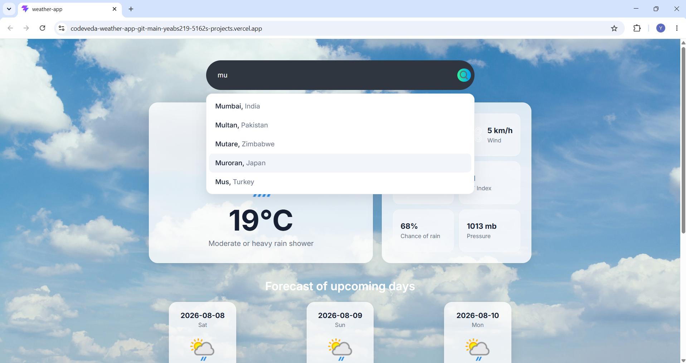
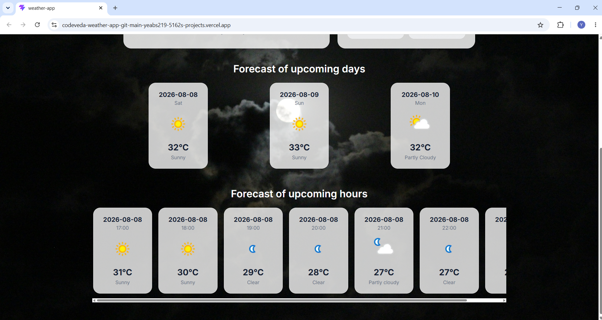
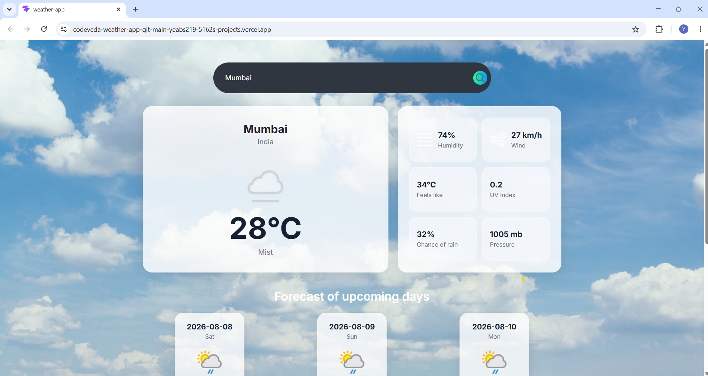

# 🌦️ Weather App

A responsive weather application built with **React.js** and **WeatherAPI**. The application allows users to search for cities, view current weather conditions, explore upcoming hourly and daily forecasts, and experience a dynamic interface that adapts to the current time of day.

## 🚀 Live Demo

[View the Weather App](https://codeveda-weather-app-git-main-yeabs219-5162s-projects.vercel.app/)

## 📸 Screenshots

### city suggestion



### Hourly & Daily Forecast



### Day & Night Mode



## 📂 GitHub Repository

[View the source code](https://github.com/yeabs219-debug/codeveda-weather-app)

---

## ✨ Features

* 🔎 **City Search & Autocomplete**

  * Search for cities using WeatherAPI.
  * Receive location suggestions while typing.
  * Select a suggested city to view its weather.

* 🌡️ **Current Weather**

  * Displays the current temperature and weather condition.
  * Shows additional information such as humidity and wind speed.

* 🕐 **Hourly Forecast**

  * Displays upcoming hourly weather conditions.
  * Automatically filters out hours that have already passed.

* 📅 **Daily Forecast**

  * Provides weather information for upcoming days.

* 🌅 **Dynamic Day/Night Background**

  * Uses the API's `is_day` value to dynamically change the application's background depending on whether it is currently day or night.

* ⚠️ **Error Handling**

  * Provides user-friendly messages when a city cannot be found or weather data cannot be loaded.

* ⏳ **Loading States**

  * Displays a loading indicator while weather data is being fetched.

* 📱 **Responsive Design**

  * The interface adapts to different screen sizes, including desktop and mobile devices.

* 🔄 **Conditional Rendering**

  * UI elements are rendered dynamically based on loading states, errors, search results, and available weather data.

---

## 🛠️ Technologies Used

* **React.js** — Component-based user interface development
* **JavaScript (ES6+)** — Application logic and asynchronous operations
* **Vite** — Development environment and build tool
* **CSS** — Styling, responsive layouts, and dynamic visual presentation
* **WeatherAPI** — Weather and forecast data

---

## 🧠 What I Practiced

This project was built to strengthen my understanding of front-end development with React.

Key concepts practiced include:

* React components
* Props
* State management with `useState`
* Side effects with `useEffect`
* Asynchronous JavaScript
* Fetching and processing API data
* Debounced search
* Conditional rendering
* Error handling
* Loading states
* Working with external APIs
* Responsive CSS
* Dynamic UI based on API data

---

## 🔄 How It Works

The application follows a simple data flow:

```text
User searches for a city
        ↓
Autocomplete searches WeatherAPI
        ↓
User selects a city
        ↓
Weather data is requested
        ↓
API response is processed
        ↓
React state is updated
        ↓
Weather information is rendered
```

The application also uses the API's `is_day` value to determine whether the current conditions represent daytime or nighttime and changes the background accordingly.

---

## 📸 Main Application Sections

The application provides information including:

* Current temperature
* Weather condition
* Humidity
* Wind speed
* Upcoming hourly weather
* Multi-day forecast
* City and country information

---

## ⚙️ Getting Started

### Prerequisites

Make sure you have **Node.js** installed on your computer.

### 1. Clone the repository

```bash
git clone https://github.com/yeabs219-debug/codeveda-weather-app.git
```

### 2. Navigate to the project

```bash
cd codeveda-weather-app
```

### 3. Install dependencies

```bash
npm install
```

### 4. Configure the API key

Create a `.env` file in the project root:

```env
VITE_WEATHER_API=your_weatherapi_key
```

Replace `your_weatherapi_key` with your WeatherAPI key.

> **Note:** The API key should be stored in an environment variable rather than directly inside the source code.

### 5. Start the development server

```bash
npm run dev
```

The application will then be available through the local development URL provided by Vite.

---

## 📁 Project Structure

```text
src/
├── assets/
├── components/
├── services/
├── utils/
├── Weather.jsx
└── ...
```

The project separates UI components, API-related functionality, assets, and utility logic to keep the application organized and maintainable.

---

## 🎯 Internship Context

This project was developed as part of my **Codveda Technology Web Development Internship — Level 2**.

### Task

**Level 2 — Task 3: Introduction to Front-End Frameworks (React or Vue)**

The task required creating a component-based application using a front-end framework while demonstrating concepts such as components, props, state management, and a practical application such as a weather app.

This project extends the basic requirement by integrating a live weather API, autocomplete search, hourly and daily forecasts, dynamic day/night presentation, responsive design, and user-friendly loading and error states.

---

## 👨‍💻 Author

**Yeabsira Tesfaye**

Aspiring Software Developer

---

## 📄 License

This project was created for educational and internship purposes.
